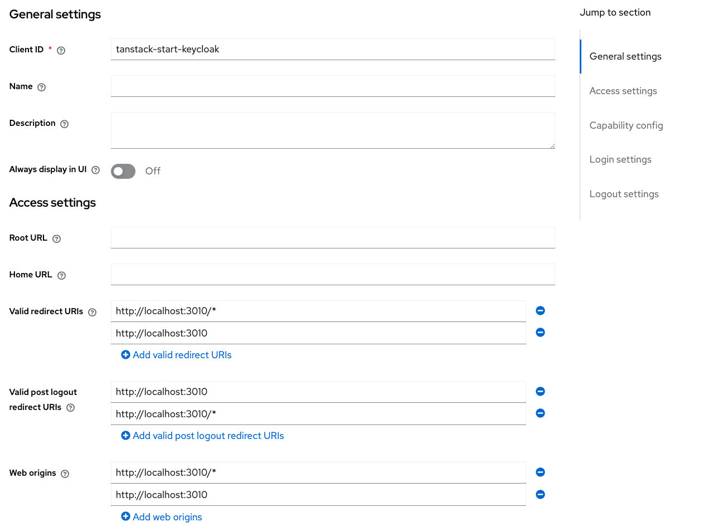

# TanStack-start with keycloakJS

This is an example for using keycloakJS library together with TanstackStart.

It was the main goal to allow all Tanstack-Router features like loading, pre-loading to work seamless.

So this solution uses router-context.

## Getting Started

### Prerequisites

This is a devcontainer repo and works on VSCode devcontainers. Nothing else to install.

> You need a running docker desktop for your Devcontainer-Based VSCode

It uses the following ports:

- keycloak: localhost:8280
- keycloak db: localhost: 5432 (internally 5435)

You can change these ports by working on [.devcontainer/docker-compose.yml](.devcontainer/docker-compose.yml)

Starting the application occupies port 3010 (dev and start). To change that you have to modify [package.json](package.json)

### Installing

1. Open the repo in VS Code and build/load it in DevContainer.

2. Open the local keycloak admin console in the browser by [http://localhost:8280]

3. Login to your local keycloak as admin/admin

4. Select the master realm and create a new client with

   > clients => create client

5. Name the secret
   > tanstack-start-keycloak
6. Add validate redirect URIs

- http://localhost:3010
- http://localhost:3010/\*

7. Same post-logout URI's
8. Web-origins should be also the same



## Running the application

No additional settings are needed.

```
npm run dev
```

or

```
npm build
npm run start
```

npm install is executed on devcontainer start

## References

- [TanStack Start](https://tanstack.com/router/latest/docs/framework/react/start/overview) - The web framework used
- [keycloakJS](https://github.com/keycloak/keycloak/tree/main/js/libs/keycloak-js) - Keycloak client library

## Authors

- **Michael H. Vogt** - _Typescript Developer_ - [progwise.net](https://github.com/progwise)

See also the list of [contributors](https://github.com/progwise/tanstack-start-keycloak/contributors) who participated in this project.

## License

This project is licensed under the MIT License - see the [LICENSE.md](LICENSE.md) file for details

## Acknowledgments

- Hat tip to anyone whose code was used
- Inspiration
- etc
